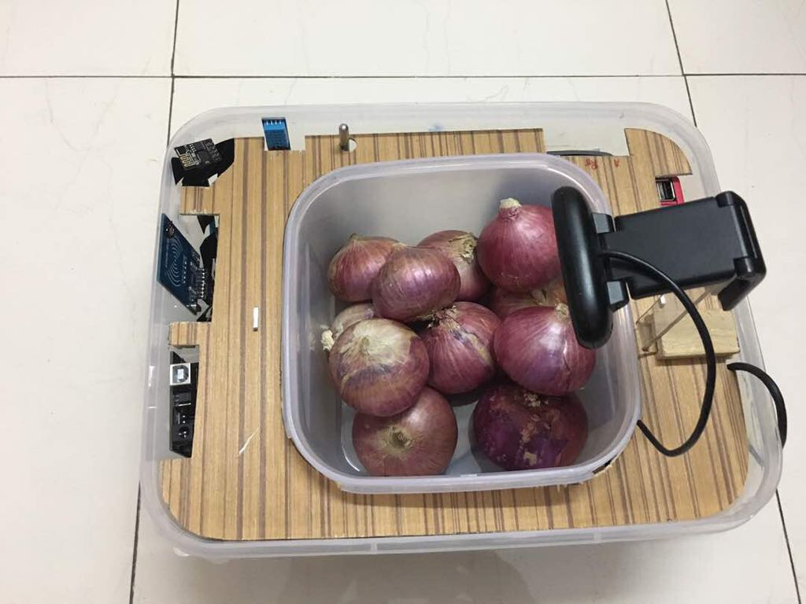

# iDabba
Source code for everything related to iDabba Project

Our project, named "iDabba" is a smart container which identifies what fruit/vegetable/item is kept in it ( the item has to be one of those trained for image analysis ), the surrounding temperature, humidity of the item, and its weight. All this information is visible to the user via a web app.
The container designed is fuss-free, convenient and washable. We were motivated to design this project to easily solve everyday hassles in kitchens and households regarding spoilage and infestation. It can even be scaled to meet the needs of farmers and storage companies for smart storing options and act as a small-scale silo.

  - Our Apparatus

  - Our WebApp

  
Poster Presentations

 
Featured on our Director's Blog : https://jalote.wordpress.com/2017/09/13/introducing-engineering-design-in-first-year-of-a-btech-program/
 

Project Page: https://virresh.github.io/projects/iDabba

      
